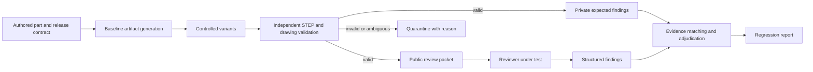

# Architecture and engineering rules

This document preserves the original design proposal and its engineering rationale.
The implemented API and finite support boundary are recorded in
[V1_CONTRACT.md](V1_CONTRACT.md), [DEMO.md](DEMO.md), and the
[requirements evidence matrix](REQUIREMENTS_EVIDENCE.md). Proposed interfaces,
thresholds, and fixture counts below are historical design choices unless those
implementation records explicitly verify them.

## The user workflow

1. Choose a small suite and a versioned manufacturing profile.
2. Generate challenge packets, or replay an existing immutable suite.
3. Validate the exported artifacts. Invalid fixtures never enter the scoring denominator unnoticed.
4. Export only the public packet and ordinary review instructions to the reviewer.
5. Import structured findings, or run a configured local adapter.
6. Compare two reviewer versions and open a local HTML report. Investigate the exact changed case rather than accepting an aggregate score.

The core requires no hosted model. A reference reviewer exists only to exercise the protocol. At least one independent external reviewer must be demonstrated before claiming product usefulness.

## Geometry boundary

Initial families are (A) a plate with a scoped through-hole pattern, (B) a block with blind bores/counterbores, and (C) a block with an open rectangular pocket and a controlled wall. One valid solid, planar faces and cylindrical bores; fixed, declared setups. Include sections wherever required to make the visible drawing unambiguous. Exclude interacting bores, complex blends, modeled helical threads, freeform surfaces and inaccessible enclosed cavities in v1.

The initial candidate was OCCT with build123d/Draftwright. M0 retained that drawing
path; v1 uses build123d with a finite ReportLab layout. See [LICENSES.md](LICENSES.md)
and the pinned requirements for actual dependencies and licensing. The original
proposal to reuse automatic drawing placement is not a claim of general v1 drafting.

The independent geometry validator reopens the exported STEP in a separate process/module and measures relevant faces. It must not read in-memory generator objects or private expected values. Analytic volume, hole count, envelope and dimension calculations on these simple families provide a second check. The same underlying CAD kernel is still a shared dependency; disclose this common-mode limit. A second kernel is not required for v1.

## Data contracts

| Contract | Required information |
|---|---|
| `PacketSpec` | Schema version; opaque case ID; file hashes; units; part identity; explicitly allowed CAD/drawing revision association; artifact authority; manufacturing stage; material/temper/finish declarations; critical requirements; selected profile; declared setup; public feature/view associations. |
| `CapabilityProfile` | Version/hash; source citations and dates; assumptions; material class; maximum stock/work envelope and allowances; advisory thresholds; known defaults; precedence; unsupported operations. Profiles may be synthetic but must say so. |
| `MutationSpec` | Private operator/version/seed; prerequisites; intended obligation affected; allowed artifact differences; expected assertion; forbidden collateral changes. Never exported to the reviewer. |
| `OracleRecord` | Independent measurements and their units/tolerances; visible text/region evidence; checks of mutation isolation; expected issue or justified non-issue; confidence basis; validation status and reason; oracle version. |
| `ReviewResult` | Packet hash; reviewer/version/configuration; explicit completed/partial/unsupported/error status; reviewed modalities/obligations; findings; explicit clear/unknown assertions; runtime and raw-output reference. |
| `Finding` | Category; conclusion class; public feature or document location; quoted evidence or geometric witness; units/values where applicable; rationale; optional confidence. No private mutation ID is required or supplied. |
| `RunManifest` | Input hashes; suite/profile/oracle/adapter versions; platform/dependencies; seed; model/prompt if applicable; timing/cost if measured; limitations and all failures. |

V1 premise/obligation extraction is limited to the public release contract, supported visible drawing annotations/notes and ordinary STEP geometry. It does not interpret arbitrary semantic PMI; any such requirement is unsupported until that optional reader is implemented.

Public context is essential: a missing requirement cannot be scored if the reviewer never received the requirement. A CAD revision and a drawing revision may legitimately differ; the release contract says which combination is approved. Feature IDs refer to actual public features, not labels such as `defect_17`. Strip answer keys, revealing filenames, PDF metadata and generator assessment sidecars from exported review bundles.

## Controlled variants

Each objective operator needs a defective case, a repaired twin and a valid lookalike. Include an underdetermined case when removing context genuinely makes the conclusion undecidable. Variants are authored semantically and regenerated; do not paint over text in arbitrary PDFs and assume the hidden text or geometry still means the same thing.

| ID | Defect and expected conclusion | Independent evidence and clean controls |
|---|---|---|
| O01 | Change an explicitly mapped bore annotation from 6.00 ±0.05 to 6.80 ±0.05 mm while same-stage STEP stays at 6.00 mm. Package contradiction. | Measure exported cylinder; read actual annotation and manufacturing stage. A declared pre/post-process allowance and a drawing-only reference dimension are valid alternatives. |
| O02 | Change a scoped `4X` bore group to `3X`. Group count contradiction. | Recognize four bores in the declared group; inspect the visible leader/group association. Other views and unrelated equal-diameter bores must not inflate the count. |
| O03 | Change the applicable drawing-unit declaration without converting governed values. Unit contradiction. | Normalize actual STEP units and visible drawing values. Correctly converted inch/mm drawings, mixed-unit local overrides and page rescaling are controls. |
| O04 | Introduce two incompatible global material declarations with the same applicability and no resolving precedence. Specification conflict. | Read both exported declarations and authority rules. Genuine aliases, a separately scoped surface-treatment note, unspecified temper and explicit precedence must not be mislabeled as conflicts. Use a deliberately small reviewed alias map. |
| O05 | Remove the sole representation of a declared critical requirement. Missing release requirement. | Public release contract still requires it; final drawing/model/notes contain no valid replacement. Sparse CAD-authoritative drawings and requirements satisfied by a visible authoritative note are valid controls. Semantic-PMI alternatives are deferred until a supported reader exists. Do not score arbitrary missing dimensions. |
| O06 | Substitute a drawing outside the explicitly permitted release association. Package/revision association error. | Compare public release association and actual visible/file identifiers. Legitimately independent CAD/drawing revisions are a clean control. Do not claim a revision mismatch proves geometric incompatibility. |

O03 can create many dimensional symptoms of one root cause. Expected answers group these as one obligation; the scorer must not demand dozens of duplicate findings. O05 is only scored within a finite declared requirement vocabulary. Entire-drawing completeness is outside scope.

## CNC advisory and profile track

Manufacturability is not a universal binary property. Tooling, orientation, workholding, stock, supplier capability and acceptance requirements matter. These sources inform conditional rule cards:

| Rule | Reputable source and meaning | Proposed test behavior |
|---|---|---|
| A01 Wall thickness | [Xometry CNC tips](https://www.xometry.com/resources/machining/10-tips-improve-cad-cnc-design/) recommends about 0.794 mm for metal and 1.5 mm for plastic. [Protolabs milling guidelines](https://www.protolabs.com/services/cnc-machining/cnc-milling/design-guidelines/) discusses thin-feature advisories around 0.51 mm. | Source-specific recommendation, not a physical limit. A 0.60 mm test wall under one named advisory profile should produce a risk advisory, not “unmachinable.” Use boundary and alternate-profile controls. |
| A02 Hole depth/diameter | [Protolabs Network guide](https://www.hubs.com/knowledge-base/how-design-parts-cnc-machining/) distinguishes recommended 4D, typical 10D and feasible 40D hole depths. | L/D above a recommended threshold is an advisory. Do not turn the largest published value into a universal maximum. Scope drill depth and geometry clearly. |
| A03 Setup envelope | [Protolabs milling guidelines](https://www.protolabs.com/services/cnc-machining/cnc-milling/design-guidelines/) publishes service- and material-dependent capacities. | Use an explicitly synthetic, versioned machine/setup profile initially. Check stock plus fixture allowance in the declared orientation. Failure means outside that setup, not impossible on another machine/orientation. |
| A04 Finish and tolerance stage | [Xometry manufacturing standards](https://www.xometry.com/manufacturing-standards/) and [its post-processing discussion](https://xometry.pro/en-eu/articles/impact-post-processing-dimensional-accuracy/) informed the question of dimensional effects; they do not establish the implemented CNC inspection-stage default. The v1 default is explicitly project-selected and synthetic. | Test whether stage is established by explicit requirements or the declared project profile. Missing stage is unknown only if no precedence resolves it. No universal coating-thickness compensation or invented material/finish compatibility chart. |
| A05 Drawing obligations | [Protolabs Network drawing guide](https://www.hubs.com/knowledge-base/how-prepare-technical-drawing-cnc-machining/) explains that CAD can provide geometry while drawings communicate critical features and special requirements. | A sparse drawing can be valid. Check only declared obligations, not an arbitrary demand for every model dimension. |

Every rule card stores an ID/version, publisher/URL/date, short paraphrase, exact profile threshold and units, applicability, evidence required, comparator and boundary semantics, severity, precedence and limits. Mark project-chosen values as synthetic. Material affects profile applicability; it does not justify extrapolating a complete cutting-parameter database.

Use `contradiction`, `profile_exclusion`, `advisory`, `missing_information`, `supported_clear` and `unsupported` as distinct conclusion classes. `invalid_fixture` belongs to corpus validation, not to the reviewer's manufacturing decision. Never collapse them to a green/red “machinable” badge.

## Independent artifact validation

1. Validate the baseline against its finite contract: single-solid geometry, expected simple topology, units, feature correspondence, visible annotations and consistent declarations.
2. Export variants, then discard generator objects. Re-import each scored STEP. Verify measurements against analytic expectations with explicitly recorded numerical tolerances.
3. Extract PDF text and coordinates using a separate parser; render the PDF and inspect glyph visibility, clipping and annotation association. Hidden PDF text is not visual evidence. PNG dimensions and numerical labels must come from annotation content, never pixel scale.
4. Verify the intended delta and check invariants outside it: unrelated geometry, controlled callouts, identity, process stage and authority. Record incidental errors and quarantine the case rather than silently relabeling it.
5. For PNG cases, require automated legibility/region checks plus reviewed representative operator/layout variants. Ambiguous glyph recognition is an invalid or unverified fixture. OCR is a fallible validation signal, not a perfect oracle.
6. Inspect every hand-authored release case. Retain invalid-fixture records and report the invalid rate. Freeze the validated suite before comparing reviewers.

A validator written by another agent is useful organizational independence, not proof of mathematical independence. Mutation tests must deliberately break unit conversions, comparisons, answer-key isolation and unknown handling to establish that checks can catch those faults.

## Scoring without rewarding overconfidence

Score obligations, not merely sentences. Each expected issue has allowed categories, a public feature/region, its conclusion class and a short rationale. Match findings one-to-one to expected issues using deterministic fields and evidence overlap. A vague “check tolerances” cannot receive credit for a particular dimensional contradiction. Duplicate findings cannot multiply recall. Keep grouping rules fixed before the run.

Record at least:

- Defect recall by operator: matched expected defective obligations / scorable defective obligations.
- Clean-control false-alert rate: adjudicated incorrect alerts on named clean obligations / evaluated clean obligations. Do not claim all other drawing content is proven clean.
- Explicit false-clear rate: defective obligations explicitly declared clear / applicable defective obligations. A silent miss is separately a miss; it is not automatically an explicit false-clear assertion.
- Appropriate abstention, coverage and abstention rate on underdetermined cases. Always abstaining earns no defect detections.
- Severity/profile reasoning errors, invalid fixture rate, reviewer errors/timeouts and unsupported modalities.
- Paired regression counts: detected→missed, missed→detected, correct-clear→false-alert and changes in justified uncertainty.

Unmatched findings can be genuine incidental errors. Label them `unadjudicated`, retain them and prevent a misleading finalized precision score until they are reviewed. An adjudication record contains the reason and oracle version. Fixing the answer key creates a new benchmark version; rerun both compared reviewers or clearly invalidate their comparison.

No single weighted “engineering intelligence score” in v1. Report sample counts and denominators. If repeating a nondeterministic reviewer, report per-run variability and seeds/configuration where available. Do not claim confidence intervals or significance from one small run.

## Isolation, replay and failure behavior

Separate `public/` packets, private oracle records and raw reviewer results. External processes receive only the public bundle path and run in a bounded working directory. A local same-user process is not a security sandbox; do not claim adversarial containment. Honest blinding is sufficient for the first development benchmark, and its limitations must be recorded.

Validate file signatures, path traversal, schema versions, size/page limits, number of solids and parser timeouts. Escape report content. Disable network use by default. No execution of code embedded in drawings. Interrupted or partial runs remain inspectable and can resume without overwriting prior results.

Reproducibility means stable semantics, geometry within recorded tolerance and a content-addressed manifest. CAD/PDF exporters may emit variable timestamps/identifiers; normalize nonsemantic fields where possible and do not require byte-identical exports across different kernels or platforms. Hash the actual artifacts used in each run.

## Deliberate deferrals

Arbitrary user STEP/drawing imports require manually declared feature mappings and an independently authored oracle before scoring; this is a Should item, not the first release foundation. Native `.slddrw` import is excluded: [SolidWorks Document Manager](https://help.solidworks.com/2024/english/api/swdocmgrapi/GettingStarted-swdocmgrapi.html?id=8.2) has licensing/key requirements, and native file support would complicate a simple open-source core. Users can export PDF and STEP.

Full GD&T, fit-table reproduction, tolerance-stack proof, process planning, collision-free toolpaths, workholding synthesis, turning, five-axis machining, molding and stamping are excluded. [Analysis Situs](https://analysissitus.org/features/features_recognize-cnc-milling-features.html) and existing geometry toolkits already cover substantial feature-recognition work; reuse appropriate capabilities instead of claiming them as new.
