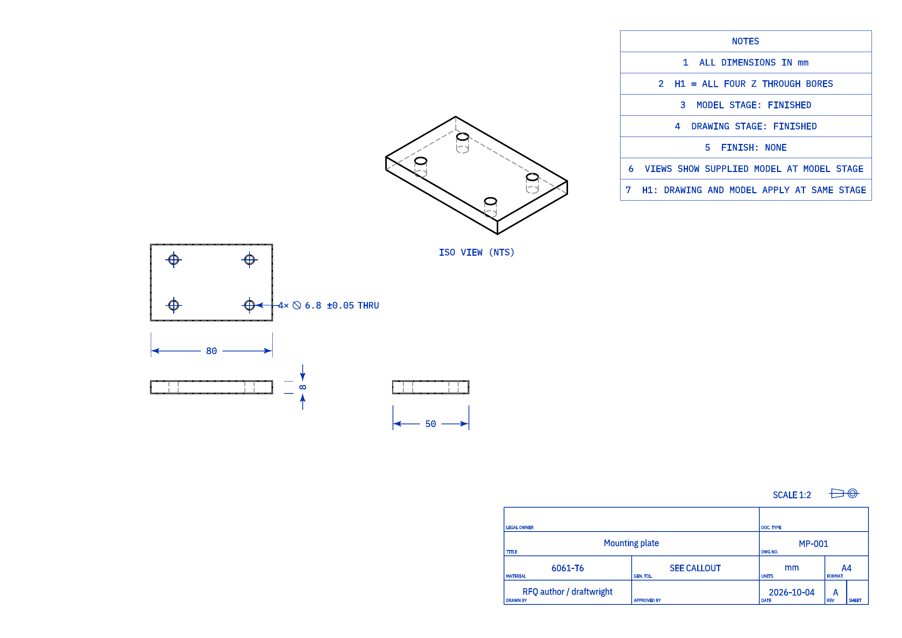
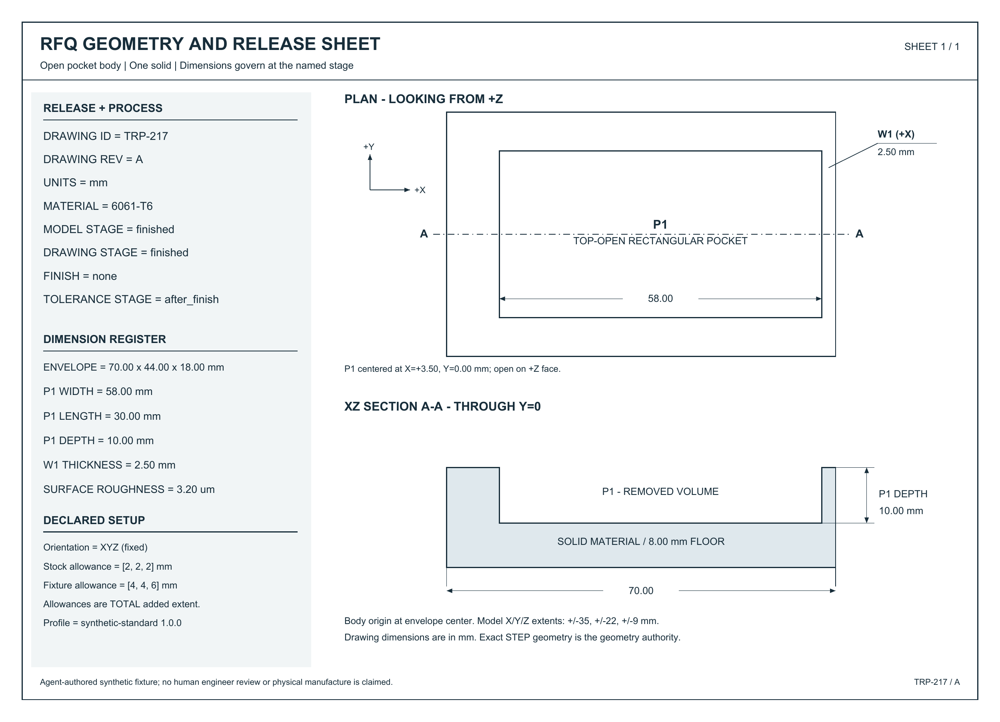

# Testing the tool that checks the drawing

*Local, unpublished draft. Independent consumer verification remains an editorial item before this draft is finalized.*

I started with an awkward question: when software tells me an engineering drawing looks good, what evidence would make that answer useful? A list of warnings is easy to produce. Knowing which warnings describe real contradictions, which describe conditional concerns, and which admit missing information takes more care.

My first idea was a general CNC drawing reviewer. The [research record](RESEARCH_AND_GO_NO_GO.md) pointed to existing commercial drawing review and open-source geometry tools. A bounded source check did not identify an equivalent combined public regression workflow, but that is a limited observation, not a novelty or demand claim. I chose a smaller question: can I give a reviewer a controlled package, verify the package independently, and explain when its answers change?

The first example was an 80 × 50 × 8 mm plate with four through-bores. Reopening the exported STEP measured all four at 6.00 mm. The drawing said 6.80 ±0.05 mm, and both files applied to the finished stage. Six millimetres falls outside the drawing interval, so this was a concrete package contradiction. Changing the callout to 6.00 ±0.05 mm repaired it. [The retained measurements and review](../evidence/M0/review-handoff/review-output/observations.md) show the actual files inspected.

*The first synthetic challenge: the visible grouped callout conflicts with the separately measured 6 mm STEP bores at the same declared stage.*

The interesting third presentation kept the smaller bores and the larger callout. Its public contract explicitly described an intermediate model followed by reaming to the drawing size. The stage notes were visible on the page. That made the package consistent for this obligation; it did not demonstrate practical reaming feasibility. An independent Codex reviewer wrote its own STEP reader, inspected the PDF renders and supplied PNGs, and reached those three scoped conclusions. Its raw response is preserved; the exact served model version was unavailable. [M0 gate](../evidence/M0/gate.md)

I needed more than a generator that knew what it meant to draw. RFQFuzz separates authoring, final-artifact validation, the reviewer being tested, and scoring. Public packets contain ordinary STEP, vector PDF, a PNG rendered from that PDF, and the authority, process and setup premises needed to decide. Mutation labels and answers stay private. Validation reopens the files, checks geometry and visible annotations, and binds inspection to hashes. Hidden searchable text cannot stand in for a visible callout. [Artifact acceptance](../evidence/M2/core-final-acceptance.md)

Manufacturing guidance needed equally explicit limits. A measured 0.6 mm metal wall triggers an advisory under the project's synthetic 0.8 mm recommendation and clears that duty under its relaxed 0.5 mm recommendation. Neither answer approves manufacture. Exceeding a named setup envelope means exclusion from that setup. An unresolved finish stage or material premise remains unknown. The [versioned rule cards](../evidence/M1/profiles.md) distinguish source motivation from every project-selected executable value, including the finish-stage default.

The final core contains 145 synthetic presentations: 62 plates, 46 bore blocks and 37 pocket blocks. All share one bounded drawing layout and belong to development; there are zero core holdout cases. Independent final-artifact checks accepted all 145, with earlier attempts and corruption controls retained separately. Across named obligations, the corpus contains 36 package contradictions, six CNC advisories, three setup exclusions, and 40 unknowns: nine package and 31 CNC duties. Those are finite corpus counts. [Corpus accounting](../evidence/M4/corpus-summary.json)

The public-template reference shares artifact readers with validation, so its agreement is infrastructure evidence with a common implementation dependency. To test regression diagnosis, I deliberately removed one detected material contradiction and falsely flagged a legitimate diameter control. The local report shows a detection becoming a silent miss and a correct clear becoming a false alert, with links to the exact evidence. These two changes are injected demonstrations. They are not observed failures of an external reviewer. [Retained comparison](../evidence/M4/challenge-report.md)

<!-- EDITORIAL PENDING: after the coordinator creates and inspects evidence/M5/browser/report-changed-evidence.png, optionally insert it here as figure three. Do not embed a nonexistent screenshot or imply browser acceptance from source inspection. -->

Coding agents helped with bounded implementation work in isolated checkouts. Their corrections mattered more than their count. A material conflict initially left conditional CNC conclusions too confident; unresolved equal-authority premises now produce uncertainty. A leakage filter also rejected the harmless word “permutation,” which prompted complete-word label checks while recursive private-key rejection remained. [Consumer preparation](../evidence/M5/consumer-preparation.md)

An independent code audit then caught a less comfortable mistake: witness matching could credit “count=40” against a required count of four. Complete canonical witness matching now rejects the altered number. That audit also found reports insufficiently bound to the supplied oracle and artifact versions; reports now check those hashes before rendering. I retained the failing probes and repair evidence. Separately, unchanged acceptance tests caught six deliberately broken evaluator implementations involving units, boundaries, severity, duplicates, leakage and unknown handling. [Independent fixes](../evidence/M5/independent-fixes.md), [evaluator challenge](../evidence/M4/challenge-report.md)

A genuine external v1 review independently inspected two public packets: a thin-wall pocket and a sparse CAD-authoritative plate. It covered 15 duties. Fourteen decisions had grounded witnesses under the strict scorer; one units assertion remains unadjudicated because its witness format did not match. I preserve that distinction instead of counting it as either a correct answer or a reviewer error. Two packets provide a useful interface observation, not a benchmark ranking. [Scoped external result](../evidence/M5/external-v1/summary.json)

*A separate synthetic authoring path: 70 × 44 × 18 mm body, a 58 × 30 × 10 mm pocket, and a 2.5 mm mapped wall.*

This separate packet exposed the importer's finite vocabulary: its first “REV” label was rejected, while “DRAWING REV” was accepted after revision. Both attempts remain. The new layout and independent measurements are useful diagnostics; they are agent-authored and still share OCCT. [Transfer provenance](../evidence/M5/transfer-v2/author/PROVENANCE.md)

The [local demo](DEMO.md) replays retained inputs, validates exports, imports responses and produces an offline comparison report without an API key. build123d and OCCT supply core CAD geometry; Draftwright produced the preserved M0 drawing, while ReportLab supplies the bounded v1 vector layout. Their [licenses and contributions](LICENSES.md) belong in the account. Beads was not adopted. Clean consumer platform acceptance is still being finalized for this draft.

I have no manufactured part, shop-floor validation, engineer-authored oracle or evidence of demand to report. The next useful experiment is a separately governed engineer-authored packet with ambiguous correspondence resolved before scoring. It would test whether these concrete regression obligations survive outside the comfortable drawing vocabulary I built them in.
